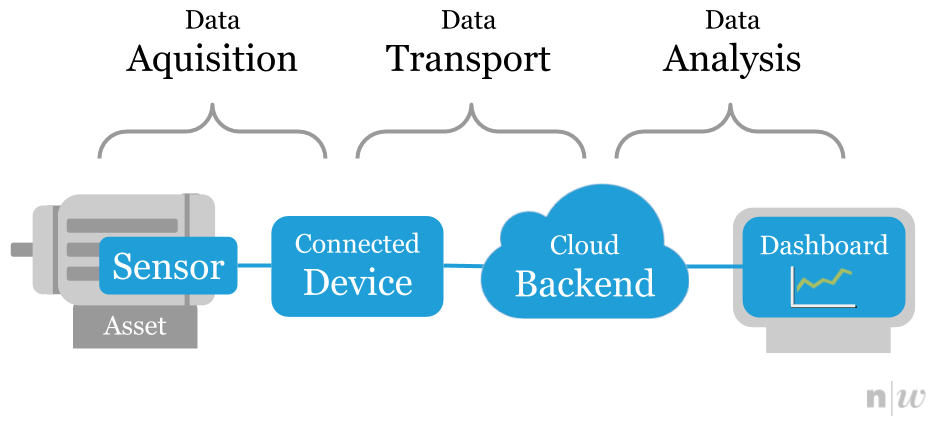

# IoT Data Collection (idb)
Competence *idb* by [T. Amberg](https://twitter.com/tamberg) & [J. Luthiger](https://www.fhnw.ch/en/people/juerg-luthiger) for [FHNW](https://www.fhnw.ch/).

## Overview
<table><tr><td></td></tr></table>

## Resources
Resources and code examples to get into Internet of Things (IoT) data collection:

1. [Introduction](introduction/README.md) - how to get started with CircuitPython, nRF52840 and Raspberry Pi.
2. [Data Acquisition](data-acquisition/README.md) - how to acquire measurement data from sensors.
3. [Data Transport](data-transport/README.md) - how to transport data to the backend.
4. [Data Analysis](data-analysis/README.md) - how to analyse time series data.

## Hardware
The following hardware is available:

* [Raspberry Pi Zero W](https://github.com/tamberg/fhnw-idb/wiki/Raspberry-Pi-Zero-W)
* [Feather nRF52840 Express](https://github.com/tamberg/fhnw-idb/wiki/Feather-nRF52840-Express)
* [FeatherWing ESP32 AirLift](https://github.com/tamberg/fhnw-idb/wiki/FeatherWing-ESP32-AirLift) Wi-Fi
* [FeatherWing RFM95W](https://github.com/tamberg/fhnw-idb/wiki/FeatherWing-RFM95W)
* [Grove Sensors](https://github.com/tamberg/fhnw-idb/wiki/Grove-Sensors) & [Actuators](https://github.com/tamberg/fhnw-idb/wiki/Grove-Actuators)
* [Grove Adapters](https://github.com/tamberg/fhnw-idb/wiki/Grove-Adapters)

## Wiki
For additional resources, check the [IoT Data Collection Wiki](https://github.com/tamberg/fhnw-idb/wiki):

* [Books](https://github.com/tamberg/fhnw-idb/wiki/IoT-Books)
* [Hardware](https://github.com/tamberg/fhnw-idb/wiki#hardware)
* [IoT platforms](https://github.com/tamberg/fhnw-idb/wiki#iot-platforms)
* [Development tools](https://github.com/tamberg/fhnw-idb/wiki#development-tools)

## License

Unless noted otherwise:

* Source code examples in this repository are declared Public Domain [CC0 1.0](https://creativecommons.org/publicdomain/zero/1.0/)
* Slides by [T. Amberg](https://twitter.com/tamberg) & [J. Luthiger](https://www.fhnw.ch/en/people/juerg-luthiger) are licensed under Creative Commons [CC BY-SA 4.0](https://creativecommons.org/licenses/by-sa/4.0/)

Publishing your own code?

* [Choose an open source license](https://choosealicense.com/), e.g. the simple [MIT License](https://choosealicense.com/licenses/mit/)
