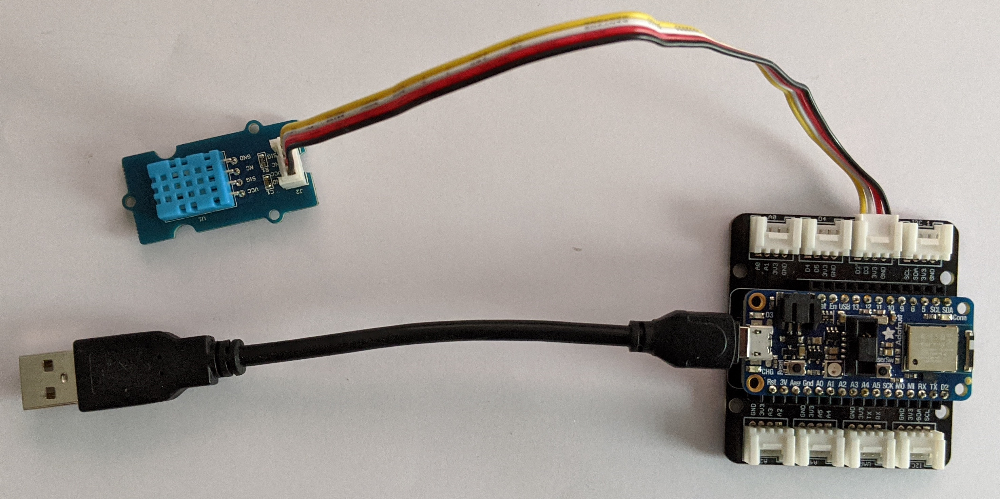
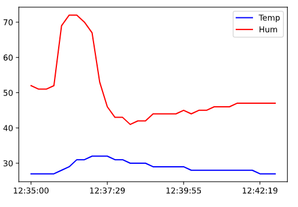
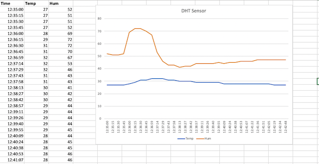

# Reading a DHT temperature & humidity sensor
How to read and visualize a DHT sensor with CircuitPython.

## Running the example
* Set up the [hardware](#Hardware), connect it to your computer via USB.
* Copy the content of [dht.py](dht.py) to _code.py_ on the _CIRCUITPY_ drive.
* Consider opening the [serial plotter](https://codewith.mu/en/tutorials/1.0/plotter) (available if you are using the [Mu Python editor](https://github.com/tamberg/fhnw-idb/wiki/Mu-Python-editor)).

## Hardware
* [Feather nRF52840 Express](https://github.com/tamberg/fhnw-idb/wiki/Feather-nRF52840-Express) microcontroller.
* [Grove shield for Feather](https://github.com/tamberg/fhnw-idb/wiki/Grove-Adapters#grove-shield-for-feather) to connect sensors.
* [DHT11](https://github.com/tamberg/fhnw-idb/wiki/Grove-Sensors#temperature--humidity-sensor-dht11) wired to Grove _D2_ (nRF52840 _D5_) (see figure 1).

Figure 1: DHT sensor connected to PIN D2

## Visualize and Analyse the sensor values

### Create Excel file (format csv)

The console output can be copied and pasted into an excel file.

1. Open a new text file.

2. Create the column header with `Time,Temp,Hum`.

2. Copy and paste the values from the console into the text file. Separate the columns with a comma.

3. Save the file as `dht.csv`.

### Visualize

Using Jupyter notebook (Option 1):

1. Open the given Jupyter notebook [`dht.ipynb`](./dht.ipynb).

2. Check the filename of the csv-file, which is loaded into the notebook.

3. Run the notebook. You should get something, as shown in figure 3.

   

   Figure 3: Example of a visualisation in Jupyter notebook

Using Excel (Option 2):

1. Create a diagram to visualize the temperature and humidity. You should get something, as shown in figure 4:

   

   Figure 4: Example of a visualisation in Excel

### Analyse

Analyse the data for wrong or missing values. This can happen! The sensor is cheap! **Improve the program, if necessary.** You should have a reasonable output in the end.
