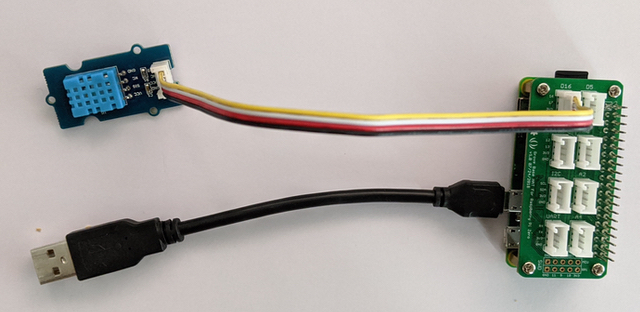
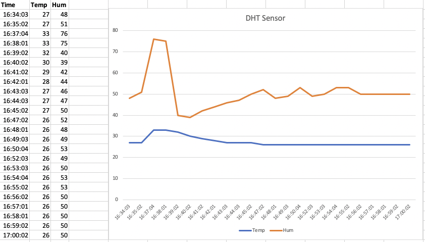

# Reading a DHT temperature & humidity sensor

How to read and visualize a DHT sensor with Python on a Raspberry Pi. 

The example is based on the information found in:

- the [SEEED Docs](https://github.com/Seeed-Studio/Seeed_Python_DHT)
- this [post](https://www.deviceplus.com/raspberry-pi/lets-build-mobile-gadget-using-compact-raspberry-pi-zero-build-environment-check-device-using-grove-sensor/)

## Hardware
* [Raspberry Pi Zero W](https://github.com/tamberg/fhnw-idb/wiki/Raspberry-Pi-Zero-W) controller.
* [Grove Base Hat for Raspberry Pi](https://github.com/tamberg/fhnw-idb/wiki/Grove-Adapters#grove-base-hat-for-raspberry-pi) to connect sensors.
* [DHT11](https://github.com/tamberg/fhnw-idb/wiki/Grove-Sensors#temperature--humidity-sensor-dht11) wired to Grove _D16_ (Raspberry Pi _Pin 16_) (see figure 1).



Figure 1: DHT sensor connected to D16

## Running the example

1. Check that the library `grove.py` is installed on your Raspberry Pi, with:

    ```shell
    $ pip3 show grove.py
    Name: grove.py
    Version: 0.6
    Summary: Python library for Seeedstudio Grove devices
    ...
    ```

2. Check that the library `seeed-python-dht` is installed on your Raspberry Pi, with
   if not (pip3 install seeed-python-dht):

    ```shell
    $ pip3 show seeed-python-dht
    Name: grove.py
    Version: 0.0.2
    Home-page: https://github.com/Seeed-Studio/Seeed_Python_DHT
    Author: Baozhu Zuo
    Author-email: zuobaozhu@gmail.com
    License: MIT
    ...
    ```

3. Download the file [`dht.py`](dht.py) on to your Raspberry Pi.

   This is a small python program using the DHT sensor, which is connected to PIN D16, to read out the temperature and humidity and to print these values to the console, including a timestamp.

   Note that this program has no main loop.

4. Run the program with

   ```shell
   $ python3 dht.py
   09:19:45,25,53
   ```

   As you can see, the sensor is read just once. The values are separated by a comma, to be prepared to create a cvs file for Excel.

## Create Excel file (format csv)

The console output can be redirected into a file, with:

```shell
$ python3 dht.py > dht.csv
```

The `cron` system application can be used to schedule a program at a given interval. 

1. On your Raspberry Pi load the crontab file into a editor:

   ```shell
   $ crontab -e
   ```

2. Add the following entry:

   ```shell
   * * * * * /usr/bin/python3 /home/pi/dht/dht.py >> /tmp/dht.csv 
   ```

   Adding this entry, `cron` will schedule the program `dht.py` **each minute** and append the console output to file `/tmp/dht.csv`.

   **Note**: 

   - The path entries must match your setup!

3. Save the crontab file.

4. `cron` will now run the program each minute. Check if the values are appended to file `dht.csv`.

## Visualize and Analyse the sensor values

1. Copy the file `dht.csv` to your computer and import this file into Excel. 

2. Create a diagram to visualize the temperature and humidity. You should get something like shown in figure 2.

   

   Figure 2: Example of a visualisation in Excel

3. Analyse the data for wrong or missing values. It can happen! The sensor is cheap!

4. **Improve the program, if necessary.** You should have a reasonable output in the end.

## Option

Use a Jupyter notebook.
