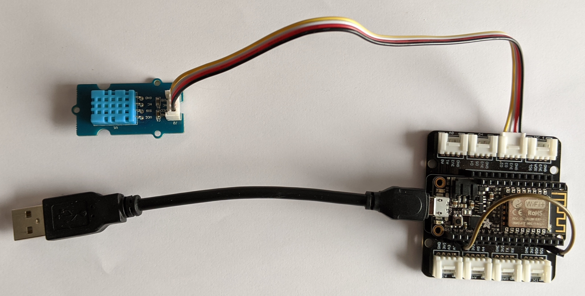
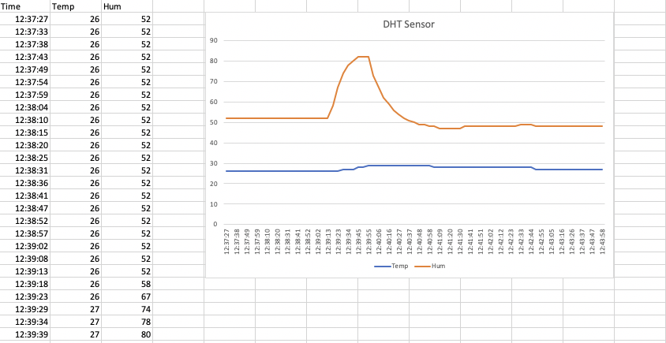

# Using DHT sensor with MicroPython on ESP8266

## Prerequisites

You have successfully completed all steps in [Getting Started](../../introduction/esp8266/README.md). That means: 

- You have the MU-Editor installed.
- You the firmware flashed on your ESP8266.
- You can run the [Blink App](../../introduction/esp8266/blink/README.md).

## DHT sensor in action

This Lab is based on the information found in

- the [DHT MicroPython Docs](https://docs.micropython.org/en/latest/esp32/quickref.html#dht-driver)

### Connecting the DHT sensor to the Raspberry Pi

Connect the DHT sensor to PIN D2 of the Grove Adapter, as shown in figure 1.

Figure 1: DHT sensor connected to PIN D2

### Read the DHT sensor

1. Open your MU-Editor and connect your ESP8266 over USB.

2. Load the file [`dht.py`](dht.py) on to your Raspberry Pi.

   This is a small python app  using the DHT sensor, which is connected to PIN D2, to read out the temperature and humidity and to print  these values to the console, including a timestamp. 

3. Run the app (see figure 2).

   

   Figure 2: App `dht.py` in action

   The values are printed out to the console.

### Create Excel file (format csv)

The console output can be copied and pasted into a excel file.

1. Open a new Excel file.

2. Copy and paste the values from the console into the Excel file.

3. Save the file.

### Visualize and Analyse the sensor values

2. Create a diagram to visualize the temperature and humidity. You should get something like shown in figure 3.

   

   Figure 3: Example of a visualisation in Excel

3. Analyse the data for wrong or missing values. It can happen! The sensor is cheap!

4. **Improve the program, if necessary.** You should have a reasonable output in the end.