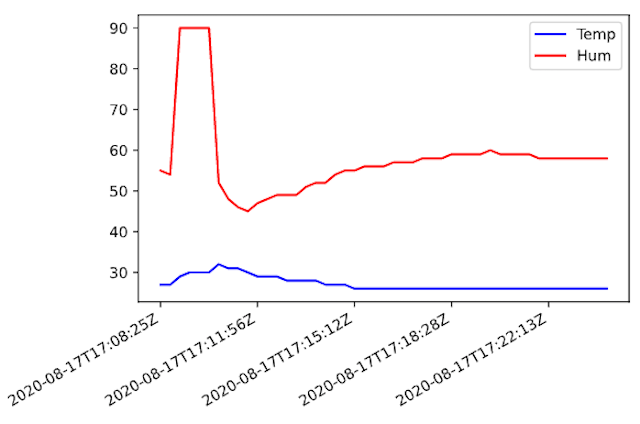

# Data Analysis

1. [Overview](#overview)
2. [Resources](#resources)
3. [Using the ThingSpeak IoT platform](#using-the-thingspeak-iot-platform)
4. [Exporting Data from the ThingSpeak IoT platform](#exporting-data-from-the-thingspeak-iot-platform)

## Overview
<table><tr><td></td></tr></table>

>Data analysis is a process of inspecting, cleansing, transforming and modeling data with the goal of discovering useful information. 

--- from Wikipedia

To analyse datas stored on the *Cloud Backend*, tools like *dashboards* are used.

We will use examples of such tools to find out:

* How to access the backend to be able to analyse these datas?
* How different tools of the backend can be used for the analysis?
* How to export datas into another system?

## Resources
- Documentation and Examples on [ThingSpeak](https://ch.mathworks.com/help/thingspeak/index.html?s_tid=CRUX_lftnav).

## Using the ThingSpeak IoT platform

On ThingSpeak you can visualize and analyse the data easily as shown in Figure 1.

Figure 1: Example of visualization widgets (red border)

Try it, after reading these tutorials:
* _Numeric Display Widget_: see tutorial [Channel Display Widgets](https://ch.mathworks.com/help/thingspeak/channel_display_widgets.html#numeric-widget)
* _MATLAB Visualization_: see tutorial [MATLAB Visualizations App](https://ch.mathworks.com/help/thingspeak/matlab-visualizations-app.html)

## Exporting Data from the ThingSpeak IoT platform

Jupyter notebooks can be used to read, analyze and visualize data from ThingSpeak (see Figure 2).

Figure 2: Example of visualization on Jupyter notebook

Try it, after reading these information and tutorials:
* [REST API](https://ch.mathworks.com/help/thingspeak/rest-api.html)
* [Read data from all fields in a channel with HTTP GET](https://ch.mathworks.com/help/thingspeak/readdata.html)
