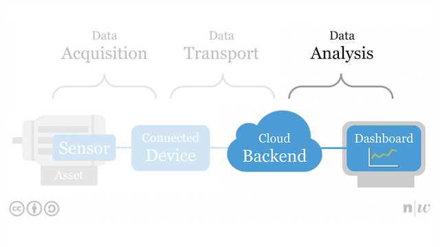

# Data Analysis

1. [Overview](#overview)
2. [Resources](#resources)

## Overview
<table><tr><td></td></tr></table>

>Data analysis is a process of inspecting, cleansing, transforming and modeling data with the goal of discovering useful information. 

--- from Wikipedia

To analyse datas, stored on the *Cloud Backend*, tools like *dashboards* are used.

We will use examples of such tools to find out:

* how to access the backend to be able to analyse these datas?
* how different tools of the backend can be used for the analysis?

## Resources
- Slides on [XYZ](http://www.tamberg.org/fhnw/2020/hs/IdbXYZ.pdf).
