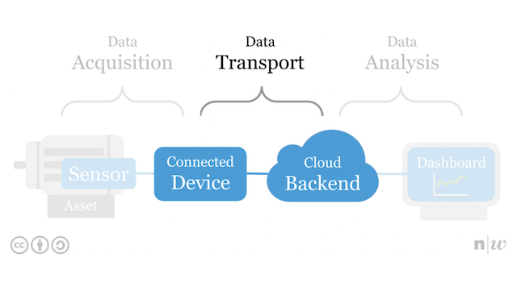

# Data Transport

1. [Overview](#overview)
2. [Resources](#resources)

## Overview
<table><tr><td></td></tr></table>

>Data transport (data transmission, also data communication or digital communications) is the transfer of data (a digital bitstream or a digitized analog signal) over a point-to-point or point-to-multipoint communication channel. 

--- from Wikipedia

To transer the data, a communication channel must be established betwenn the "Connected device" and a "Cloud Backend".

We will use examples of data transport technologies to find out:

* how to established a communication channel between two communication partners?
* how the sensors values can be transfered to the backend?
* how transfer protocols of the internet can be used to simplify the transfer?
* how these transfer protocols differs?

## Resources

- Slides on [Sending Sensor Data to IoT Platforms](http://www.tamberg.org/fhnw/2020/hs/IdbSensorDataPlatforms.pdf).
- Slides on [XYZ](http://www.tamberg.org/fhnw/2020/hs/IdbXYZ.pdf).
- Slides on [XYZ](http://www.tamberg.org/fhnw/2020/hs/IdbXYZ.pdf).
- Slides on [XYZ](http://www.tamberg.org/fhnw/2020/hs/IdbXYZ.pdf).
- Slides on [XYZ](http://www.tamberg.org/fhnw/2020/hs/IdbXYZ.pdf).

## Connecting to Wi-Fi

## ThingSpeak IoT platform

## HTTP Client
ThingSpeak

## MQTT Client
ThingSpeak

## LoRaWAN

## CircuitPython examples
Try these examples with CircuitPython on the nRF52840.

### Wi-Fi
* [Scanning Wi-Fi networks](CircuitPython/wifi_scan)
* [Connecting to a Wi-Fi network](CircuitPython/wifi_connect)
* [Reading the Wi-Fi module MAC address](CircuitPython/wifi_address)

### LoRaWAN
> TODO

## Python examples
Try these examples with Python on the Raspberry Pi.

### Wi-Fi
> TODO
