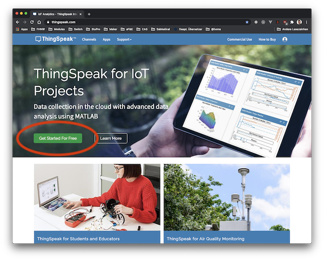
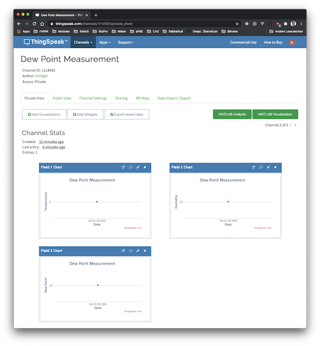

# Data Transport

1. [Overview](#overview)
2. [Resources](#resources)

## Overview
<table><tr><td></td></tr></table>

>Data transport (data transmission, also data communication or digital communications) is the transfer of data (a digital bitstream or a digitized analog signal) over a point-to-point or point-to-multipoint communication channel. 

--- from Wikipedia

To transer the data, a communication channel must be established betwenn the "Connected device" and a "Cloud Backend".

We will use examples of data transport technologies to find out:

* how to establish a communication channel between two communication parties?
* how the sensor values can be transfered to the backend?
* how transfer protocols of the internet can be used to enable the transfer?
* how these transfer protocols differ?

## Resources

- Slides on [Sending Sensor Data to IoT Platforms](http://www.tamberg.org/fhnw/2020/hs/IdbSensorDataPlatforms.pdf).
- Slides on [XYZ](http://www.tamberg.org/fhnw/2020/hs/IdbXYZ.pdf).
- Slides on [XYZ](http://www.tamberg.org/fhnw/2020/hs/IdbXYZ.pdf).
- Slides on [XYZ](http://www.tamberg.org/fhnw/2020/hs/IdbXYZ.pdf).
- Slides on [XYZ](http://www.tamberg.org/fhnw/2020/hs/IdbXYZ.pdf).

## Connecting to Wi-Fi

## ThingSpeak IoT platform

We will use [ThingSpeak](https://thingspeak.com/) as our *Cloud Backend*. ThingSpeak is an IoT analytics platform service that allows you to aggregate, visualize, and analyze live data streams in the cloud. 

For an introduction look at this tutorial:

* [Introduction to ThingSpeak](https://ch.mathworks.com/de/support/search.html/videos/introduction-to-thingspeak-107749.html?q=&fq=asset_type_name:video%20category:matlab/data-import-and-export&page=1)

Your steps to get started with ThingSpeak are:

1. **Create a free account**
    
    ThingSpeak does provide free access, but with [limited resources and functionality](https://thingspeak.com/prices/thingspeak_student). To use [ThingSpeak](https://thingspeak.com/), start creating a free account with your **FHNW email address** by clicking the button as shown in figure 1.

    </td></tr></table>

    Figure 1: Get started on ThingSpeak with a free, limited account

2. **Create a channel**
    
    To be able to collect data on ThingSpeak, you have to provide a so-called **Channel**. Use the information in [Collect Data in a New Channel](https://ch.mathworks.com/help/thingspeak/collect-data-in-a-new-channel.html) to setup your first channel with 3 fields: *Temperature, Humidity, Dew Point*

    Save the channel.

3. **Get your access keys**

    API keys enable you to write data to a channel or read data from a private channel. API keys are auto-generated when you create a new channel.

    You can access your API key icon your channel page in tab **API Keys** (see Figure 2). You will need the **Write API Key**

4. **Test your channel**

    You can test your channel by sending test data manually using the HTTP protocol.

    Use `curl` to send a HTTP POST request to ThingSpeak:

    ```
    $ curl -v https://api.thingspeak.com/update -d "api_key=MY_WRITE_API_KEY&field1=5&field2=10&field3=20"
    ```
    
    or use your browser to send a HTTP GET request, what is also supported:
    
    ```
    https://api.thingspeak.com/update?api_key=MY_WRITE_API_KEY&field1=0&field2=10&field3=20
    ```

    You should see on each chart one red point, which corresponds to your test values as shown in figure 2.

    </td></tr></table>

    Figure 2: Charts with first test data

5. **Create idb channel**

    For your [CircuitPython](#circuitpython-examples) and [Python examples](#python-examples) we need a new channel with the two fields `temperature` and `humidity`. 

    Create this channel and get the API Keys.

**Your ThingSpeak channel is now ready to collect your sensor data.**

## HTTP Client
Representational state transfer (REST) is an architectural style designed as a *request-response model* that communicates over HTTP. The ThingSpeak IoT platform uses the REST API calls GET, POST, PUT, and DELETE to create and delete channels, *read and write channel data*, and clear the data in a channel. A web browser or client sends a request to the server, which responds with data in the requested format.

* To get started with the REST API, see [REST API](https://ch.mathworks.com/help/thingspeak/rest-api.html?s_tid=CRUX_lftnav)

## MQTT Client
MQTT is a *publish/subscribe communication protocol* that uses TCP/IP sockets or WebSockets. The ThingSpeak IoT platform enables clients to update and receive updates from channel feeds via the *ThingSpeak MQTT broker*. A client device connects to the MQTT broker and can publish to a channel or subscribe to updates from that channel.

* To get started with the MQTT API, see [MQTT Basics](https://ch.mathworks.com/help/thingspeak/mqtt-basics.html).
* [List of MQTT libraries](https://github.com/mqtt/mqtt.github.io/wiki/libraries) - curated list of MQTT libraries. 


## LoRaWAN

## CircuitPython examples
Try these examples with CircuitPython on the nRF52840.

### Wi-Fi
* [Reading the Wi-Fi module MAC address](CircuitPython/wifi/wifi_address)
* [Scanning Wi-Fi networks](CircuitPython/wifi/wifi_scan)
* [Connecting to a Wi-Fi network](CircuitPython/wifi/wifi_connect)

### HTTP
These examples are using ThingSpeak as Backend.
* [Writing to the REST API on ThingSpeak](CircuitPython/wifi/thingspeak_http_post_client)

### MQTT
These examples are using a _Test Service_ as MQTT broker (Cloud Backend).
* [Publishing to a MQTT topic](CircuitPython/wifi/mqtt_pub_client)
* [Subscribing to a MQTT topic](CircuitPython/wifi/mqtt_sub_client)

These examples are using _ThingSpeak_ as MQTT broker (Cloud Backend).
* [Publishing to a MQTT topic on ThingSpeak](CircuitPython/wifi/thingspeak_mqtt_pub_client)

### LoRaWAN
> TODO

## Python examples

Try these examples with Python on the Raspberry Pi Zero W.

### Wi-Fi

Use the information [Configure Wi-Fi](https://github.com/tamberg/fhnw-idb/wiki/Raspberry-Pi-Zero-W#configure-wi-fi) on the Wiki to add your Pi to your WLAN.

Note that you can add to the configuration file `wpa_supplicant.conf` more than one network. Consider to use your hotspot to access and use a WLAN anywhere.

We will use for our examples:

* the [Eclipse Paho Python](https://github.com/eclipse/paho.mqtt.python#publishing) library to publish MQTT messages.
* the module [urllib.request](https://docs.python.org/3/library/urllib.request.html#module-urllib.request) to send simple HTTP GET requests.

Try these examples with Python on the Raspberry Pi and with Wi-Fi enabled:

* [Writing to the REST API on ThingSpeak](Python/wifi/http)
* [Publishing to a MQTT topic on ThingSpeak](Python/wifi/mqtt)


