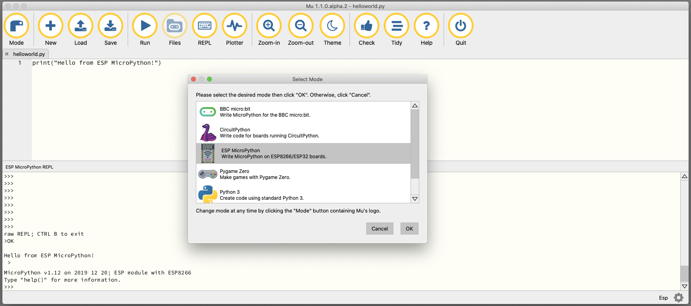

# Getting Started with <s>MicroPython</s>CircuitPython on <s>ESP8266</s>nRF52840

1. [MicroPython](#micropython)
2. [Install and Deploy your own App](#install-and-deploy-your-own-app)
3. [Using WiFi](#using-wifi)

### MicroPython

Install the firmware as follows:

- Read [Installing MicroPython](https://docs.micropython.org/en/latest/esp8266/tutorial/intro.html#intro)  from the [Quick reference for the ESP8266](https://docs.micropython.org/en/latest/esp8266/quickref.html#).

- [Get the firmware](https://docs.micropython.org/en/latest/esp8266/tutorial/intro.html#getting-the-firmware). Choose the latest stable firmware release. It's this firmware which runs the MicroPython applications on the board.

- Identify your USB Port after connecting the ESP8266 to your host computer.  
  On MacOS, it has a name like `/dev/cu.usbserial-01749340`.

- [Deploy the firmware](https://docs.micropython.org/en/latest/esp8266/tutorial/intro.html#deploying-the-firmware). The firmware must be loaded onto the ESP8622, which is connected over USB to the host. Use the tool `esptool.py`. Example on MacOS:

    ```
    % USB=/dev/cu.usbserial-01749340
    % IMAGE=esp8266-20191220-v1.12.bin
    % esptool.py --port $USB erase_flash
    % esptool.py --port $USB --baud 115200 write_flash --flash_size=detect 0 $IMAGE
    ```

- Read from [Quick reference for the ESP8266](https://docs.micropython.org/en/latest/esp8266/quickref.html#) the chapter [Getting a MicroPython REPL prompt](https://docs.micropython.org/en/latest/esp8266/tutorial/repl.html). The term “REPL” is an acronym for *Read*, *Evaluate*, *Print* and *Loop*. It is an interactive way to talk to the computer in Python.

### Running your "Hello World" on ESP8622

Launch your **MU-Editor** and follow the [Start Here!](https://codewith.mu/en/tutorials/1.0/start) tutorial to write and to run your first MicroPython application.

Notes: 
- **REPL**: Use mode "ESP MicroPython". See figure below:

  

## Install and Deploy your own App

Follow these [instructions](blink) to install a *Blink* App permanently on the ESP8622.

## Using WiFi

The ESP8622 has WiFi support on board. There are two WiFi interfaces, one for the station (when the ESP8266 connects to a router) and one for the access point (for other devices to connect to the ESP8266). Check the information on chapter [Network basics](https://docs.micropython.org/en/latest/esp8266/tutorial/network_basics.html#network-basics) to be able to connect your ESP8622 to a wireless network of your choice.

**NOTES**:
- To use WiFi in your own application, it is important to configure the WiFi network access at boot time.
- Check the [Boot process](https://docs.micropython.org/en/latest/esp8266/general.html#boot-process), especially the roles of the two files `boot.py` and `main.py`.
