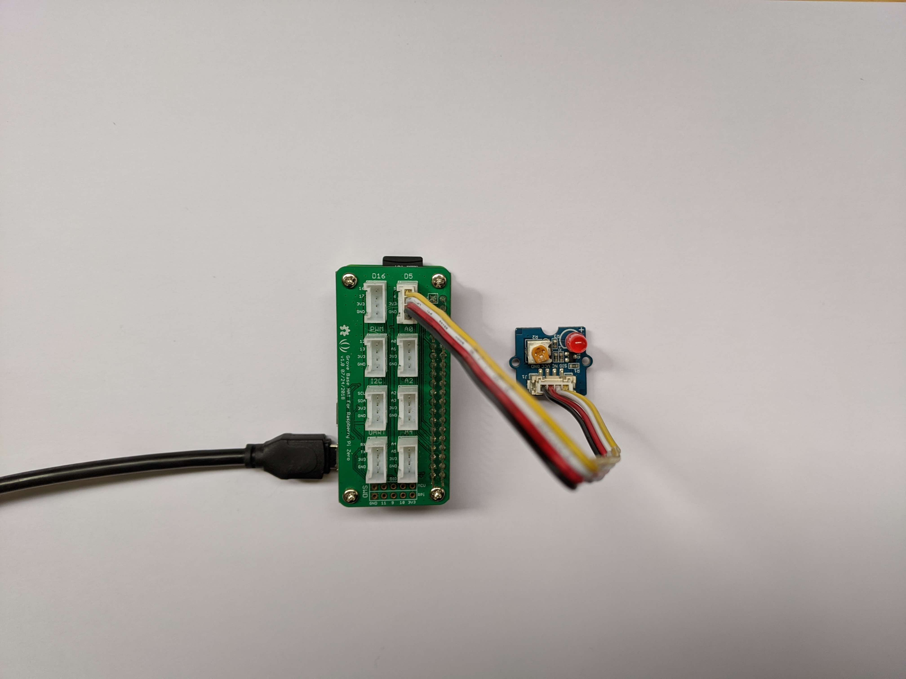

# Getting Started with Python on Raspberry Pi

1. [Prerequisites](#prerequisites)
2. [Python](#python)
3. [Install and Deploy your own App](#install-and-deploy-your-own-app)
4. [Install your App as a service](#install-your-app-as-a-service)

## Prerequisites

It is necessary to install a Raspberry Pi operation system, which is Linux-based, on your Pi. There exist several resources explaining this procedure:

- from [raspberry.org](https://www.raspberrypi.org/):  
  Read the documentation under [Installing operating system images](https://www.raspberrypi.org/documentation/installation/installing-images/README.md)
- from [idb Wiki](https://github.com/tamberg/fhnw-idb/wiki):  
  Read the Wiki Page [Setup on a Raspberry Pi Zero W](https://github.com/tamberg/fhnw-idb/wiki/Raspberry-Pi-Zero-W#setup)

**Notes**: 
- Choose **Raspberry Pi OS Lite**. The Raspberry Pi Zero W has limited computing resources. Desktop software and applications like office apps are not needed.
- Check that `ssh` and `wifi` are enabled and can be used without problems.
- Find your Pi using the information in the [Wiki](https://github.com/tamberg/fhnw-idb/wiki/Raspberry-Pi-Zero-W#find-your-pi).

## Python

A fresh installation of the Raspberry Pi OS Lite has Python 2 preinstalled. Check it with:

```shell
$ python --version
Python 2.7.16
```

To install Python 3, use:
```shell
$ sudo apt update
$ sudo apt install python3
$ sudo apt-get install python3-pip
$ python3 --version
Python 3.7.3
```

Check the [python documentation](https://www.raspberrypi.org/documentation/usage/python/) on raspberry.org. Following chaptes are important:

- Installing Python libraries
- [GPIO in Python](https://www.raspberrypi.org/documentation/usage/gpio/python/README.md)

## Install and Deploy your own App

The first, small application blinks the [Grove Red LED](https://github.com/tamberg/fhnw-idb/wiki/Grove-Actuators#led). The setup is shown in the following figure:

<table><tr><td></td></tr></table>

The LED is connected to GPIO-Pin `D5`.

Follow these [instructions](blink/README.md) to install and run a Blink App on the Rasperry Pi Zero W, even after a reboot.

## Install your App as a service