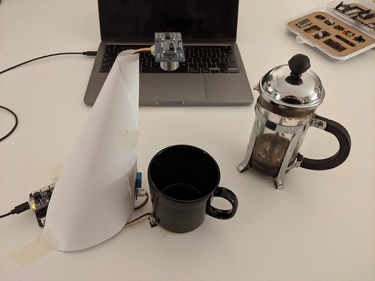

# Mini-Challenge: Hot Cup Sensor

## Description
Build a system that measures presence, temperature and filling level of a tea or coffee cup. Measurements should start as soon as a cup is placed. The measurement interval should happen fast enough to provide multiple data points during the pouring of a single cup. Once the cup is removed, the system shall stop recording and output the results in valid CSV format, to be copied into a spreadsheet.

## Steps
- Getting started with the nRF52840 or the Raspberry Pi
- Reading sensor values in CircuitPython or Python
- Writing output via Serial Monitor or console

## Questions
- Which variant, Linux or a microcontroller?
- How often do you measure, from what distance?
- What is a good way to manage your program's states?

## Deliverables
- Short report (incl. issues)
- Hardware setup
- Program source code
- Data in a CSV file

## Using a Microcontroller
- nRF52840 microcontroller
- Feather Grove adapter
- Sonar Range sensor
- Button for presence
- DHT11 for temperature

## Using a Linux Computer
- Raspberry Pi Linux computer
- Pi Grove adapter
- Sonar Range sensor
- Button for presence
- DHT11 for temperature
